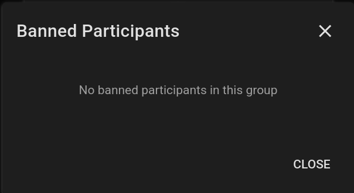
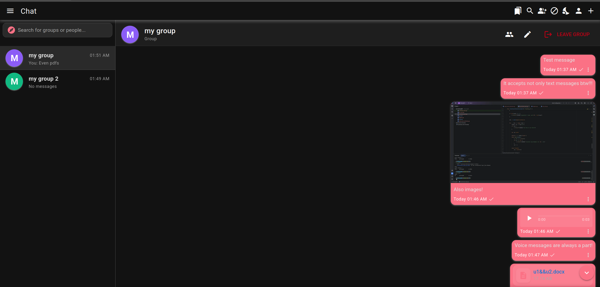
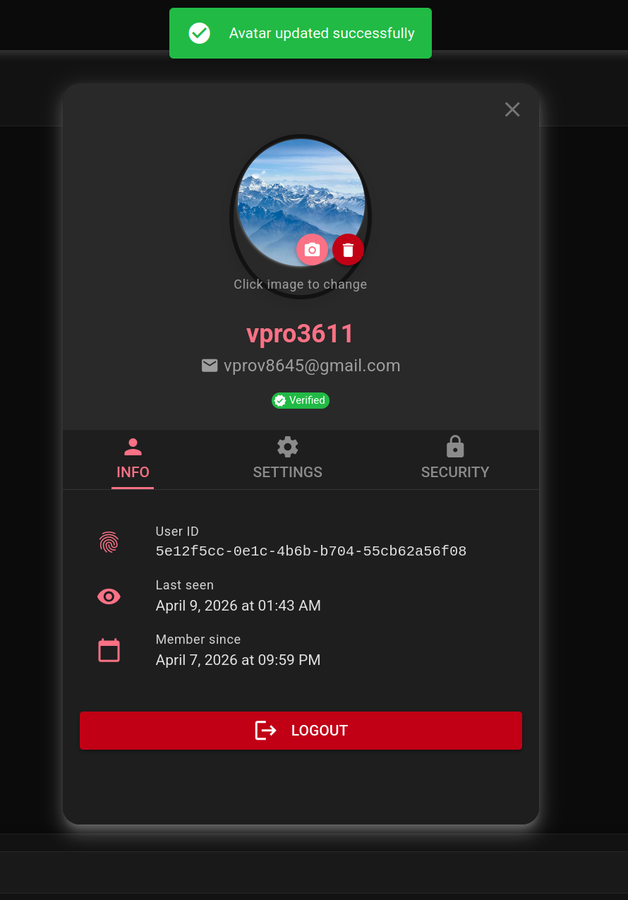
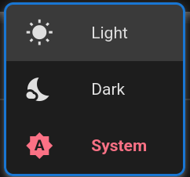
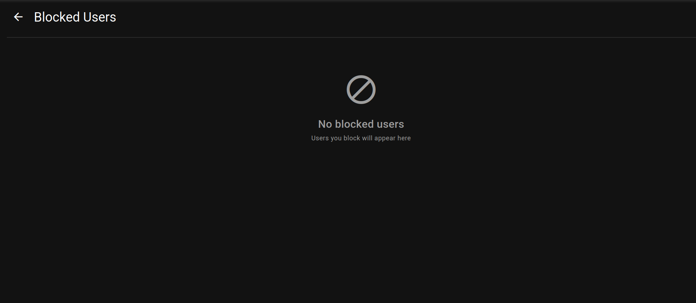
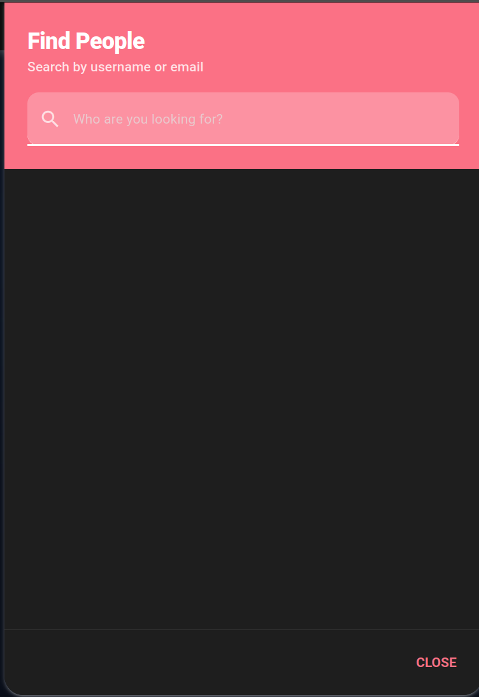
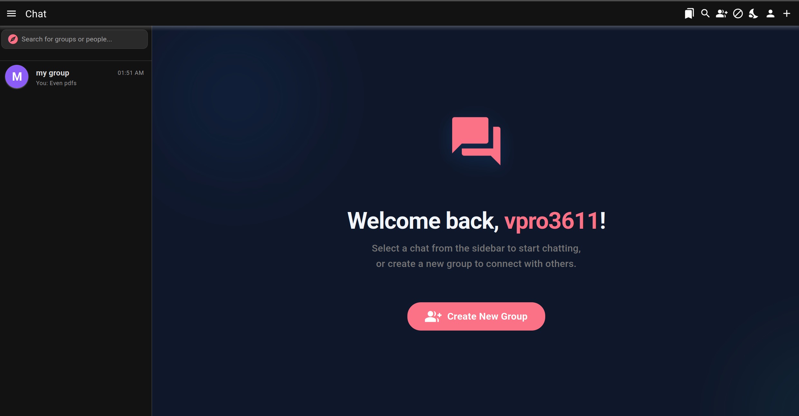

# 📘 RTChat - User Guide & Features

Welcome to the **RTChat User Guide**. This document will walk you through the key features and functionalities of the platform to help you get started quickly.

---

## 🚀 Getting Started

### 1. Welcome Screen
When you first log in, you are greeted by our modern **Welcome Screen**. This central hub confirms your identity and encourages you to start interacting.

*Modern welcome interface in light mode with animated background and quick-action buttons.*

---

## 💬 Messaging & Media

### 2. The Chat Room
The chat room is designed for speed and clarity. It supports real-time message delivery, typing indicators, and rich media.

*Real-time messaging with support for images, voice messages, and documents.*

### 3. Voice Messages & File Sharing
You can send photos, documents, and even recorded voice messages directly in the chat.
- **Voice Messages:** Integrated voice recording for more personal communication.
- **File Uploads:** Drag and drop files or use the attachment icon. Files are scanned for safety automatically.

---

## 👥 Community & Groups

### 4. Group Management
RTChat makes it easy to collaborate. You can manage participants, assign roles (Admin/Owner), and see who is currently in the group.

*Manage participants and their roles within a group chat.*

### 5. Moderation & Banning
Group owners have access to moderation tools, including a dedicated list of banned participants to keep the community safe.

*View and manage banned users in your group.*

---

## 🔒 Privacy & Search

### 6. User Blocking
Your safety is a priority. You can block users directly, and they will appear in your dedicated blocked users list.

*Manage your blocked users from a centralized list.*

### 7. Find People
Need to find someone new? Use the **Global User Search** to find people by their username or email and start new conversations instantly.

*Quickly find friends and colleagues using the global search tool.*

### 8. Outgoing Requests
Keep track of any join requests you've sent to private groups. You can see their status (Pending, Accepted, Rejected) in real-time.

*Monitor your pending group invitations.*

---

## 🎨 Personalization

### 9. Theme Customization
RTChat supports **Light**, **Dark**, and **System** themes. Switch between them instantly to suit your environment and reduce eye strain.

*Elegant theme switcher for quick personalization.*

### 10. Bookmarks & Saved Messages
Save important messages to your personal **Bookmarks** section. This is a private space where you can store notes, links, and key information from any chat.

*Keep track of important information with personal bookmarks.*

---

## 👤 Profile Settings
Manage your identity. Update your avatar, view your membership status, and manage your account details directly from the **Profile** dialog.

*Manage your account settings and personal details with ease.*

---

*Thank you for using RTChat! We hope you enjoy the experience.*
