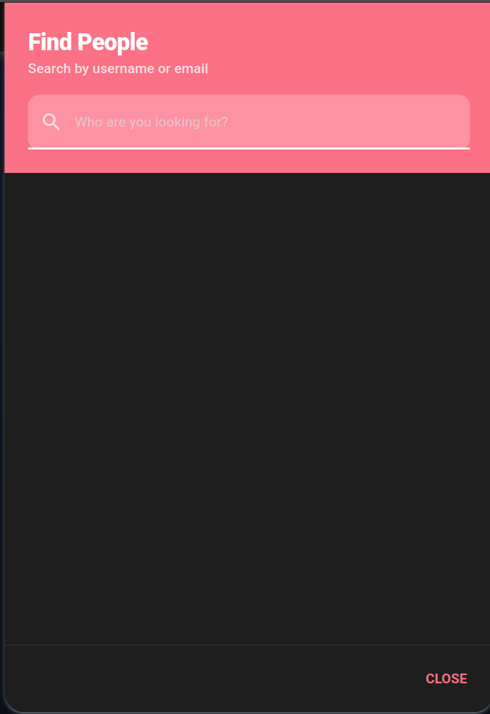
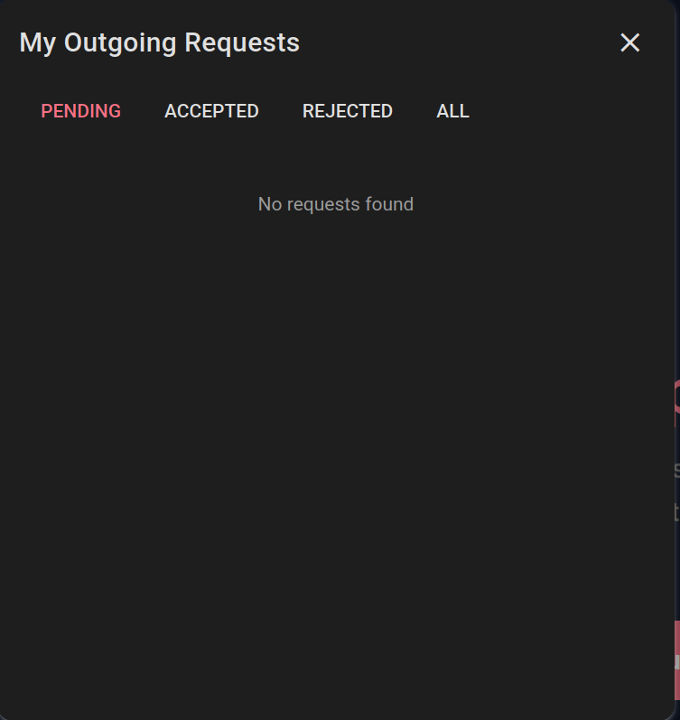
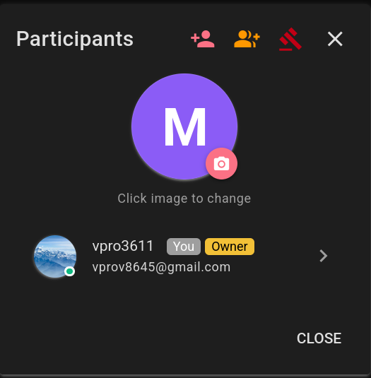
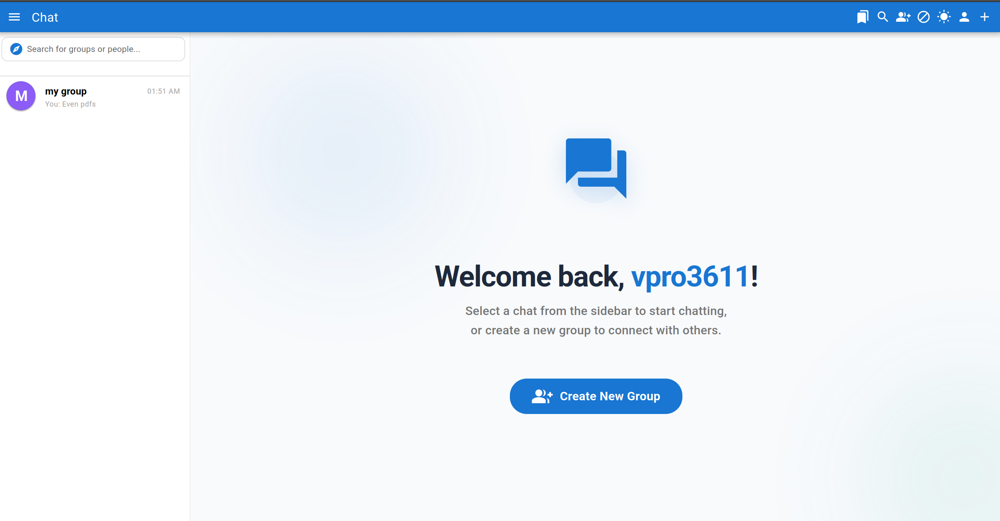

# 📘 RTChat - User Guide & Features

Welcome to the **RTChat User Guide**. This document will walk you through the key features and functionalities of the platform to help you get started quickly.

---

## 🚀 Getting Started

### 1. Welcome Screen
When you first log in, you are greeted by our modern **Welcome Screen**. This central hub confirms your identity and encourages you to start interacting.

*Modern welcome interface with animated background and quick-action buttons.*

### 2. Finding Conversations
All your active chats are listed in the **Sidebar**. You can easily toggle between your direct messages and group chats. Use the search bar at the top of the sidebar to filter through your existing conversations.

*Intuitive sidebar for navigating your chats and search functionality.*

---

## 💬 Messaging Features

### 3. The Chat Room
The chat room is designed for speed and clarity. It supports real-time message delivery, typing indicators, and read receipts.

*Real-time messaging with support for rich text and emojis.*

### 4. Rich Media & Voice Messages
You can send photos, documents, and even recorded voice messages directly in the chat.
- **Voice Messages:** Just click the microphone icon to record and send.
- **File Uploads:** Drag and drop files or use the attachment icon. Files are scanned for safety automatically.

*Integrated voice recording for more personal communication.*

---

## 👥 Group Management

### 5. Create and Manage Groups
RTChat makes it easy to collaborate. You can create new groups, manage participant roles (Admin/Member), and even mute specific members if the conversation gets too noisy.

*Comprehensive group management tools for admins.*

---

## 🔒 Privacy & Safety

### 6. User Blocking
Your safety is a priority. You can block any user directly from their profile. In direct chats, blocking someone will immediately disable the message input for both parties to prevent further unwanted contact.

*Granular blocking system to manage your personal space.*

### 7. Global Search
Need to find someone new? Use the **Global User Search** to find people by their username and start new conversations instantly.

*Quickly find friends and colleagues using the global search tool.*

---

## 🎨 Customization

### 8. Dark Mode & Themes
Switch between **Light** and **Dark** modes to suit your environment and reduce eye strain. The interface is optimized for both modes to ensure a premium look and feel.

*Elegant dark mode implementation for late-night sessions.*

### 9. Bookmarks & Saved Messages
Save important messages to your personal **Bookmarks** section. This is a private space where you can store notes, links, and key information from any chat.

*Keep track of important information with personal bookmarks.*

---

## 📱 Mobile Ready
RTChat is fully responsive. Whether you are on a desktop, tablet, or smartphone, the experience remains consistent and fluid.

*Optimized mobile experience for messaging on the go.*

---

## 👤 Profile & Settings
Manage your identity. Change your avatar, update your email, or refresh your password directly from the **Profile Settings** dialog.

*Manage your account settings and personal details with ease.*

---

*Thank you for using RTChat! We hope you enjoy the experience.*
